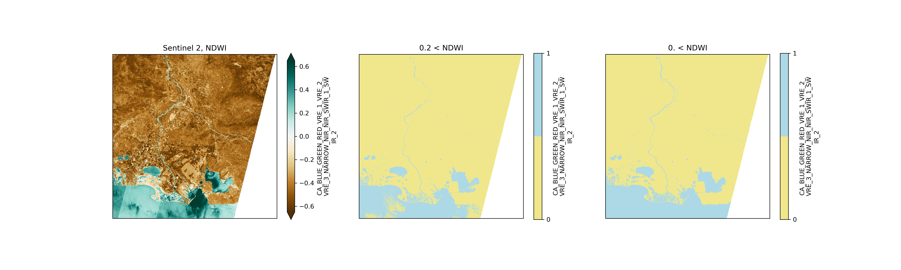

# s2driver package
## Tool for easy loading of Sentinel-2 L1C SAFE format with accurate computation of the viewing angles

# Installation
### please use conda environment
conda activate "name of your conda environment"
conda install numba rasterio
conda install gdal

python setup.py install

## Installation of the missing modules

conda install "name of the missing module"

## If it doesn't work because of conflicts between modules versions try :

pip install "name of the missing module"

## Example

## 2D-fiiting method for angle computation

